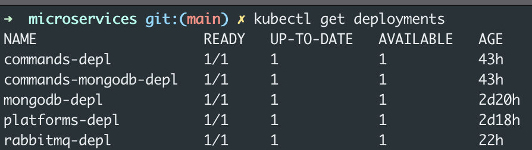
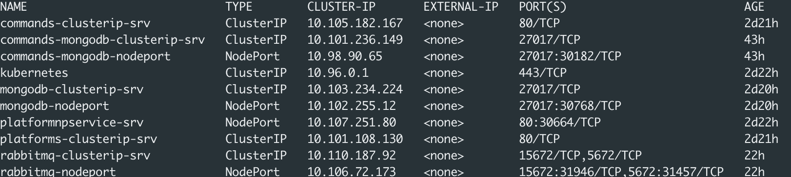
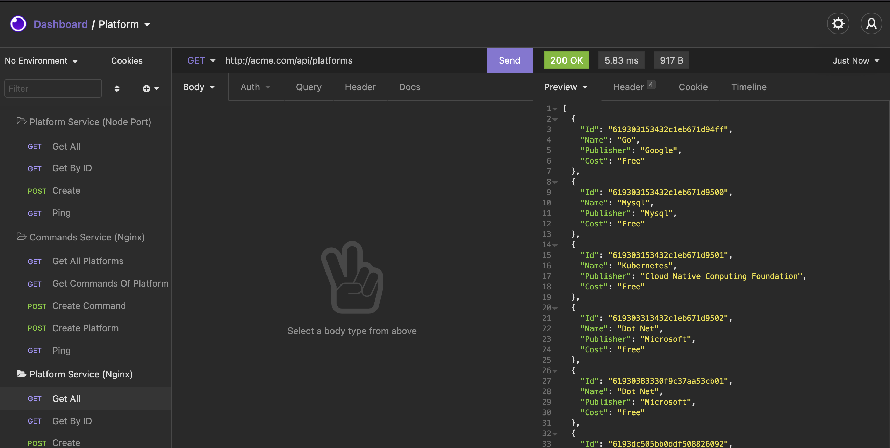

# Tech Stack

* Golang
* RabbitMQ
* Docker
* K8S
* MongoDB

## Services
* There are two services which communicate via http(sync) and rabbitmq(async). 
* Services opened to network via Ingress Api Gateway.
* Each service has its own database(MongoDB preffered for both services).

## How To Deploy K8S

* Start minikube or docker desktop kubernetes service

### Create Volumes

* `kubectl apply -f local-pvc.yaml`
* `kubectl apply -f commands-pvc.yaml`

### Deploy RabbitMQ
* `kubectl apply -f rabbitmq-depl.yaml`

### Deploy Secret (for mongo db creds for both database)
* `kubectl apply -f mongodb-secrets.yaml`

### Deploy Platform Service
* `kubectl apply -f mongodb-plat-depl.yaml`
* `kubectl apply -f platforms-depl.yaml`
  
If you want to test platform service endpoint for development purposes deploy platforms-np-srv.yaml file.

### Deploy Commands Service
* `kubectl apply -f commands-mongodb-plat-depl.yaml`
* `kubectl apply -f commands-depl.yaml`

### Deploy Ingress Service

First you should deploy ingress controller to k8s. https://kubernetes.github.io/ingress-nginx/deploy/ follow instructions in this article.

* `kubectl apply -f ingress-srv.yaml`

**On your machine edit hosts file to route acme.com dns to localhost, ingress is waiting requests for acme.com.**

## Check deployments and services are ok

`kubectl get deployments`

`kubectl get services`

You can connect databases, and rabbitmq via localhost check `kubectl get services` result to see which port assigned for them.

## Api

To get api endpoints details there is a export file in repository named microservice-insomnia.json you can import it and test endpoints.

